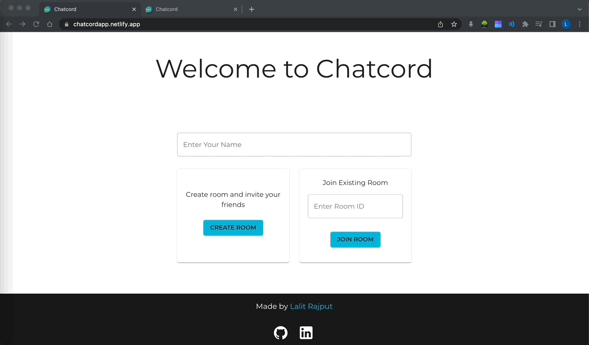
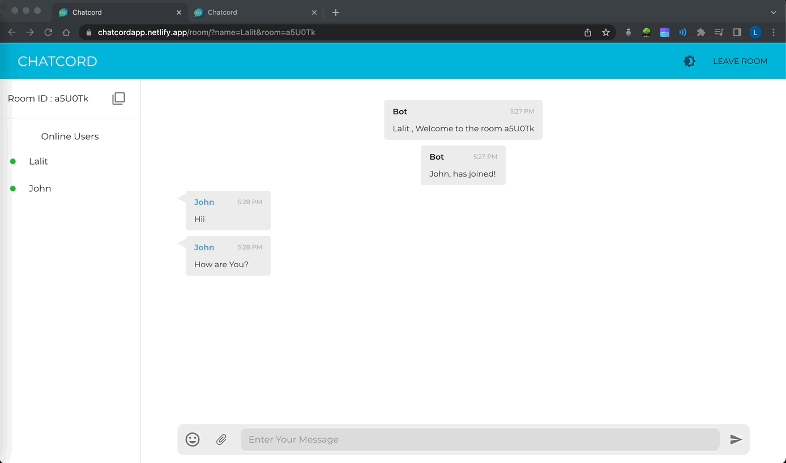
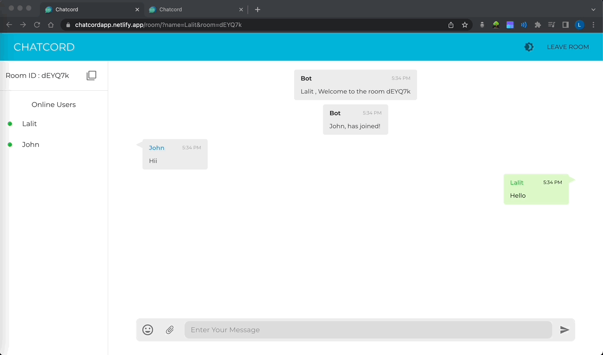

# Chatcord

A Web Application for chatting in private rooms with emoji and file sharing options. [Live Website](https://chatcordapp.netlify.app/)

## Tech Stack

**Client:** React, Material UI

**Server:** Node, Express, SocketIO

## Features

- Create Private Rooms
- Live Chatting
- Emoji and File Sharing
- Light/dark mode toggle
- Responsive Design

## Demo

Create or Join Rooms



Emoji Sharing



File Sharing



Responsiveness and Dark Mode


## Instructions

- You can create private rooms for chatting or join existing rooms using room id.

- You can share Emojis and files while chatting.

- You can see the online users in the room in the left panel.

- You can toggle between light and dark modes.

## Run Locally

Clone the project

```bash
  gh repo clone L-A-L-I-T/Chatcord
```

Folder Structure

```bash
root
 ├──  client
 └──  server
```

Go to the project directory

```bash
  cd root
```

Configuring Server Side

```bash
  cd server
```

Install dependencies

```bash
  npm install
```

Start the server

```bash
  npm start
```

Configuring Client Side

```bash
  cd client/chatapp
```

Install dependencies

```bash
  npm install
```

Start the client server

```bash
  npm start
```

## Environment Variables

To run this project, you will need to create .env file in your `root/client/myapp` folder and add the following

`REACT_APP_SERVER=localhost:8000`

## Deployment

#### Deploying Server(backend)

Before Deploying You need to make sure that `cors` and `dotenv` packages are installed in your app.

You can deploy your server usng many providers like _Vercel_, _Heroku_, _AWS_, _Qovery_, etc.

For this project i have used heroku for Deployment.

So if you are deploying using heroku, you need to create `Procfile` in `root/server` directory and add the following code

```bash
web:node index.js
```

You can follow the following resource for deployment of [node app using heroku.](https://www.freecodecamp.org/news/how-to-deploy-your-site-using-express-and-heroku/)

#### Deploying Client(frontend)

Before deployment you need to change the environment variable in `.env` file to deployed server(backend) url.

```bash
REACT_APP_SERVER=YOUR_BACKEND_SERVER_URL_OF_HEROKU
```

To build this project run

```bash
  npm run build
```

Now the build folder will be created and now you just need to deploy this project using any provider like _Firebase_, _Github Pages_, _AWS_, _Netlify_, etc.

## Authors

- [@LalitRajput](https://github.com/L-A-L-I-T)

## Other projects

Here are some Other projects

[Moviesverse](https://github.com/L-A-L-I-T/Moviesverse)

## Feedback

If you have any feedback, please reach out to me at lalitrajput201@gmail.com
